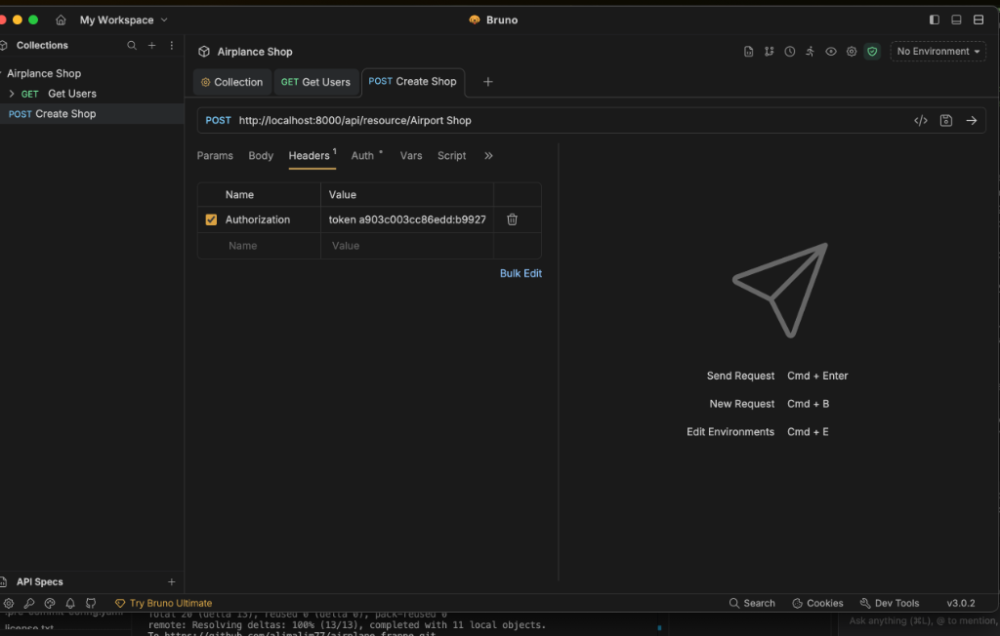
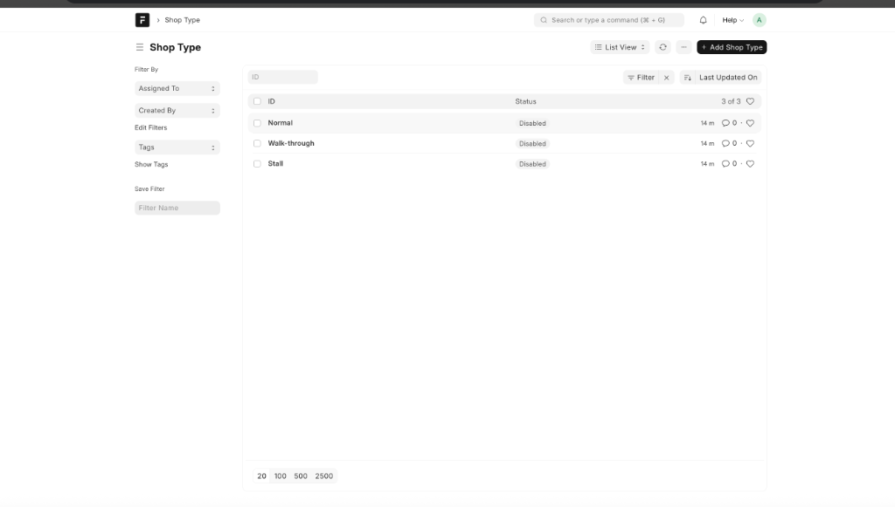
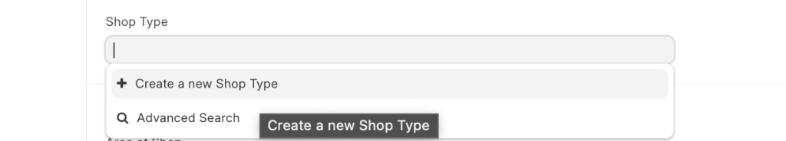
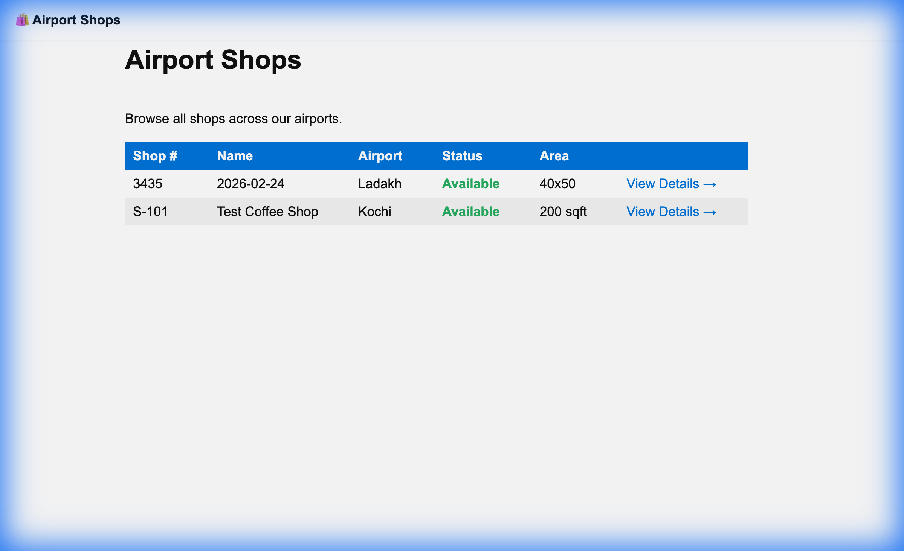
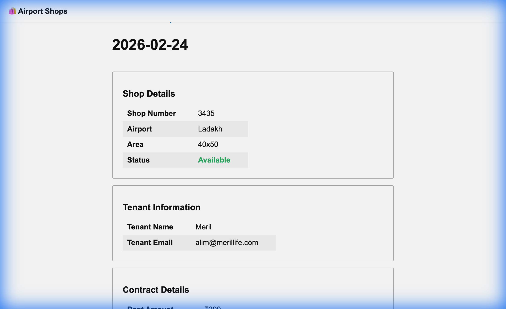
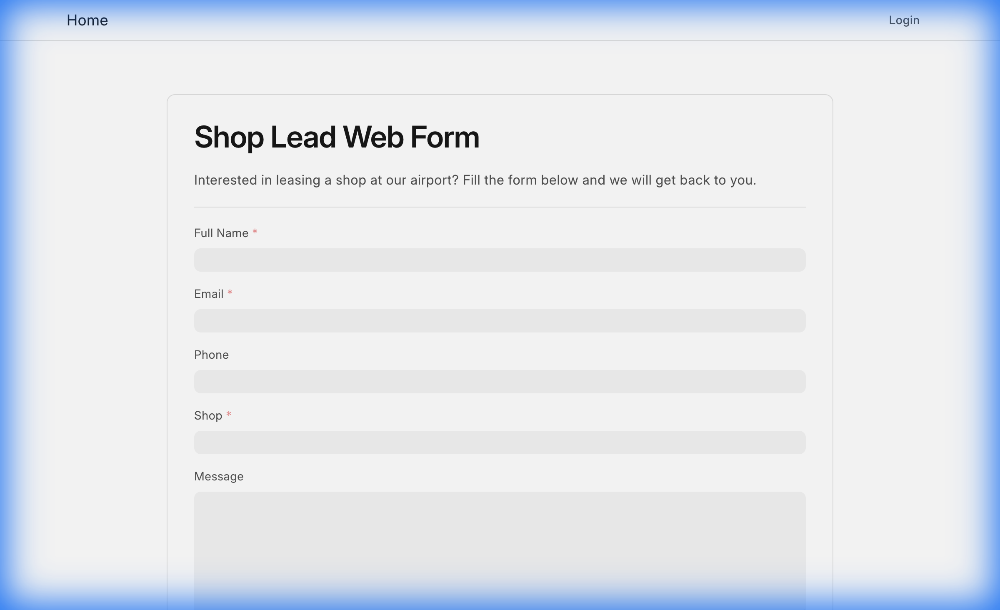

# Day 4: Implementation Documentation

This document provides a comprehensive technical breakdown of the features implemented for Day 4 of the Frappe Airplane App assignment.

---

## 1. Flight Gate Updates (Background Job)
**Requirement**: When the `gate_number` field in an `Airplane Flight` document is updated, all linked `Airplane Ticket` documents must be updated with the new gate number asynchronously.

**Implementation**:
- **File**: `airplane_mode/airplane_app/doctype/airplane_flight/airplane_flight.py`
- We use the `on_update` hook to detect changes and `frappe.enqueue` to run the update in a background worker.

```python
# airplane_flight.py

class AirplaneFlight(WebsiteGenerator):
    def on_update(self):
        # Trigger background job if gate number changes
        if self.has_value_changed("gate_number"):
            frappe.enqueue(
                update_gate_in_tickets,
                flight_name=self.name,
                gate_number=self.gate_number,
            )

def update_gate_in_tickets(flight_name, gate_number):
    """Background job to update gate number in all tickets linked to this flight."""
    tickets = frappe.get_all(
        "Airplane Ticket",
        filters={"flight": flight_name},
        pluck="name"
    )
    for ticket_name in tickets:
        frappe.db.set_value("Airplane Ticket", ticket_name, "gate", gate_number)
    frappe.db.commit()
```
---

## 2. Airport Shop Management Module

### 2.1 Domain Models
We created the following DocTypes:
- **Airport Shop**: Master record for shops.
- **Rent Collection**: Child table to track payment history.
- **Shop Type**: Configurable types (Stall, Walk-through, Normal) with an `enabled` toggle.
- **Airport Shop Settings**: Single DocType for global configuration (default rent, reminders).



### 2.2 Rent Receipt (Print Format)
A custom Jinja print format was created for `Airport Shop` to generate rent receipts.

**HTML Snippet (from `rent_receipt.json`):**
```html
<div style="padding: 20px; font-family: Arial;">
    <h2 style="text-align: center;">Rent Receipt</h2>
    <hr>
    <table style="width: 100%; margin-top: 20px;">
        <tr><td><b>Shop Number:</b></td><td>{{ doc.shop_number }}</td></tr>
        <tr><td><b>Tenant:</b></td><td>{{ doc.tenant_name }}</td></tr>
        <tr><td><b>Airport:</b></td><td>{{ doc.airport }}</td></tr>
        <tr><td><b>Monthly Rent:</b></td><td>₹{{ doc.rent_amount }}</td></tr>
    </table>

    <h3 style="margin-top: 30px;">Payment History</h3>
    <table style="width: 100%; border-collapse: collapse;">
        <!-- Iterates over child table -->
        
        <tr>
            <td style="border: 1px solid #ddd; padding: 8px;">{{ row.reference_no }}</td>
            <td style="border: 1px solid #ddd; padding: 8px;">{{ row.date }}</td>
            <td style="border: 1px solid #ddd; padding: 8px;">₹{{ row.amount_paid }}</td>
        </tr>
        
    </table>
</div>
```
### 2.3 Shop Types & Fixtures
We used **Fixtures** to export default Shop Types (Stall, Walk-through, Normal) so they are created automatically when the app is installed.

**Hooks Configuration (`hooks.py`):**
```python
fixtures = [
    # ... other fixtures
    "Shop Type"  # Exports all Shop Type records
]
```


### 2.4 Filtering Dropdowns
To ensure users only select **Enabled** shop types, we applied a filter using `set_query` in the client script.

**Client Script (`airport_shop.js`):**
```javascript
frappe.ui.form.on("Airport Shop", {
    setup(frm) {
        frm.set_query("shop_type", function () {
            return { filters: { enabled: 1 } };
        });
    }
});
```



---

## 3. Web Portal
We built a custom web portal using **Picnic CSS**. These pages do **not** inherit from the standard `web.html` template.

### 3.1 Shop List Page
**URL**: `/shops`
- **Controller**: Fetches all shops ordered by shop number.
- **Template**: Renders a clean table with status indicators.

**Controller (`www/shops/index.py`):**
```python
import frappe

def get_context(context):
    context.shops = frappe.get_all(
        "Airport Shop",
        fields=["name", "name1", "shop_number", "airport", "tenant_name", "select_pnxu"],
        order_by="shop_number asc"
    )
    context.no_cache = 1
```

**Template Snippet (`www/shops/index.html`):**
```html
<link rel="stylesheet" href="https://cdn.jsdelivr.net/npm/picnic">
<!-- ... -->
<table>
    <thead>
        <tr>
            <th>Shop #</th>
            <th>Name</th>
            <th>Status</th>
            <th></th>
        </tr>
    </thead>
    <tbody>
        
        <tr>
            <td>{{ shop.shop_number }}</td>
            <td>{{ shop.name1 }}</td>
            <td>
                
                <span style="color: #e74c3c;">Occupied</span>
                
                <span style="color: #27ae60;">Available</span>
                
            </td>
            <td><a href="/shops/details?shop={{ shop.name | urlencode }}">View Details →</a></td>
        </tr>
        
    </tbody>
</table>
```

**Screenshot:**


### 3.2 Shop Details Page
**URL**: `/shops/details?shop={shop_name}`
- **Controller**: Parses the query parameter `shop` to fetch the document.
- **Template**: Shows full details and a "Apply Now" button if the shop is available.

**Controller (`www/shops/details.py`):**
```python
import frappe

def get_context(context):
    shop_name = frappe.form_dict.shop
    if not shop_name:
        frappe.throw("Shop not specified", frappe.DoesNotExistError)

    context.shop = frappe.get_doc("Airport Shop", shop_name)
    context.no_cache = 1
```

**Template Snippet (`www/shops/details.html`):**
```html
<h1>{{ shop.name1 }}</h1>
<!-- Details Table -->
<table>
    <tr><td><strong>Rent:</strong></td><td>₹{{ shop.rent_amount }}</td></tr>
    <tr><td><strong>Status:</strong></td><td>{{ shop.select_pnxu }}</td></tr>
</table>


<div style="text-align: center;">
    <a href="/shop-lead?shop={{ shop.name | urlencode }}" class="button">
        Apply Now →
    </a>
</div>

```

**Screenshot:**


### 3.3 Shop Lead Web Form
**URL**: `/shop-lead`
We created a Web Form linked to the **Shop Lead** DocType. It allows public (guest) submissions.

**Configuration (`shop_lead_form.json`):**
```json
{
    "route": "shop-lead",
    "doc_type": "Shop Lead",
    "login_required": 0,
    "published": 1,
    "web_form_fields": [
        { "fieldname": "lead_name", "label": "Full Name", "reqd": 1 },
        { "fieldname": "email", "label": "Email", "reqd": 1 },
        { "fieldname": "shop", "label": "Shop", "reqd": 1 }
    ]
}
```

**Screenshot:**


---

## 4. API Integration
To satisfy the external API requirement, we configured:
1.  **GET** `/api/resource/Airport Shop`: Lists all shops.
2.  **POST** `/api/resource/Airport Shop`: Creates a new shop.

**Authentication**:
Authentication is handled via **API Key and Secret** generated for the System Manager.
Header: `Authorization: token api_key:api_secret`
